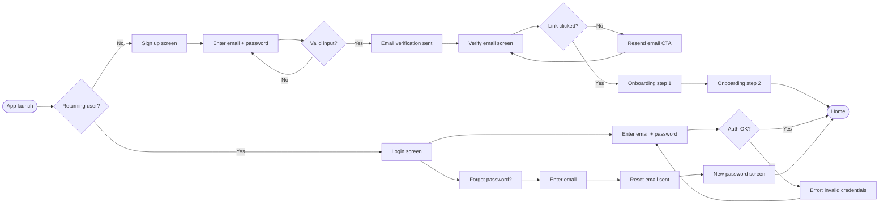

# Flow: Login and onboarding

## Flow diagram

## Screen checklist

| Screen | Trigger | Primary action | Error states | Empty state |
|--------|---------|----------------|--------------|-------------|
| Sign up | New user | Submit email + password | Invalid email format, weak password, email already taken | N/A |
| Email verification | After sign up | Click link in email | Link expired, email not received (resend CTA) | N/A |
| Onboarding step 1 | Email verified | Next | N/A | N/A |
| Onboarding step 2 | Step 1 complete | Finish | N/A | N/A |
| Login | Returning user | Submit credentials | Wrong password, account not found, account locked | N/A |
| Forgot password | Tap link on login | Submit email | Email not found | N/A |
| New password | Reset link clicked | Submit new password | Password too weak, passwords don't match, link expired | N/A |

## Open questions

- What happens if the user closes the app before completing email verification? (Resume state needed.)
- Is there a maximum number of failed login attempts before lockout?
- Is social login (Google, Apple) in scope?
