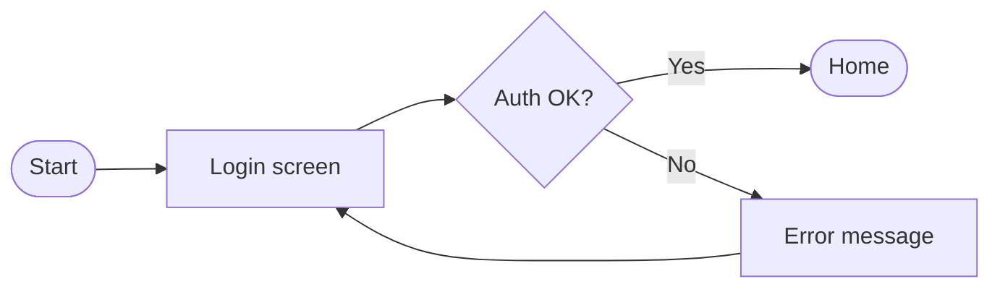

# Input: Flow to review

```mermaid
flowchart LR
  A([Start]) --> B[Login screen]
  B --> C{Auth OK?}
  C -- Yes --> D([Home])
  C -- No --> E[Error message]
  E --> B
```

Context: Login flow for a mobile banking app. Users can also use biometrics.
